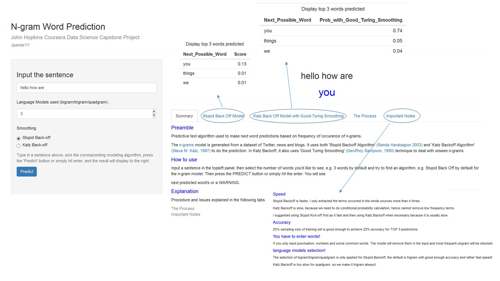

Coursera Data Science Capstone Project
========================================================
author: jpanda111
date: June 09, 2018
#class:smaller
#font-import: http://fonts.googleapis.com/css?family=Risque
#font-family: 'Risque'
#css: slides.css
#autosize: true

* This Pitch is an application that uses Natural Language Processing techniques for next words predictions. It takes a user's input phrase and suggests **TOP 3** next word predictions
* The data came from [HC Corpora](http://www.corpora.heliohost.org) including three different network sources(Blogs, News and Twitter)
* Here are some reference links:
    + [Shiny Application](https://jpanda111.shinyapps.io/shiny-app/)
    + [Milestone Report](https://jpanda111.github.io/MilestoneReport.html)
    + [Source Code](https://github.com/jpanda111/capstone_project_data_science)

Procedures
========================================================

* The data was cleaned, pre-processed (remove the punctuation, URLs, whitespace, numbers and profanity words), and tokenized
* The n-grams data table (unigram, bigram, trigram) are created and sorted by the frequency of words
* Shiny App Speed and Accuracy Tradeoff: 

    + Only Top 3 predictions with same prefix and high frequency words (freq>4)are kept in n-grams data table
    + SQL data base was created to do prediction search.
    + Increase sampling size up to 50% and extend ngram table to quadgram can further increase accuracy.

Prediction Algorithms
========================================================
## Stupid Back Off
- Trigram is first used (prefix == last two words of the user provided sentence) and return **Top 3** suggestions. 
- If not found or total less than 3, it will back off to (n-1) gram model until it back off to Unigram and return the most common words with highest frequency instead.
- The SBO does not consider unobserved n-grams, but instead backs off to the nearest matched n-gram until it reaches the unigram. So it only uses score instead of probability and lambda is set to 0.4.

## Katz Back Off with Good-Turing Smoothing
- The algorithm incorporates a form of smoothing in order to estimate probabilities of unobserved n-grams which appears to be more accurate. 
- It estimates the conditional probability of a word given its history in the n-gram. Therefore provided better results with most reliable information about a given history
- To deal with unseen words or zero probability, good turing smoothing technique is applied but only for lower freqency (< 6). For higher frequency, use PMLE which is reliable enough.

<small style="font-size:.7em">
Model Comparison Benchmark
========================================================

- Estimate prediction models efficiency (speed, memory used, accuray) with testbench from [benchmark](https://github.com/hfoffani/dsci-benchmark). The total number of test predictions is 26115.
- Since only use prediction error rate for model accuracy, this comparison mainly for Stupid Backoff. For perplexity evaluation of Katz Backoff model will leave for future work.
- From the comparison table, we can find 3-gram language modeling with 25% sampling size using sql data base will give the best accuracy and speed.

| ngram| sampling size|freq | speed(msec)| TOP 3 Accuracy (%)| memory(MB)|notes          |
|-----:|-------------:|:----|-----------:|------------------:|----------:|:--------------|
|     3|          0.15|>4   |          59|              21.91|       3.37|SBO sql        |
|     4|          0.15|>4   |         100|              22.20|       3.37|SBO sql        |
|     5|          0.15|>4   |         163|              21.12|       3.37|SBO sql        |
|     3|          0.25|>1   |        2781|              22.07|       2.40|KBO sql        |
|     3|          0.25|>4   |         470|              22.07|      17.71|SBO data table |
|     3|          0.25|>4   |          84|              22.07|       3.37|SBO sql        |
|     4|          0.25|>4   |         156|              22.48|       3.37|SBO sql        |
|     3|          0.50|>4   |         138|              22.54|       3.37|SBO sql        |
|     4|          0.50|>4   |         271|              23.06|       3.37|SBO sql        |
</small>
<small style="font-size:.7em">
The App USER INTERFACE
========================================================
- Left side : User can select from different language models and different algorithms.
- Right side: Summary tab provided some general information about this application. In each algorithm tab, TOP 3 next word predictions will be displayed as well as its score(probability). Please read the important notes before you use it.

</small>
